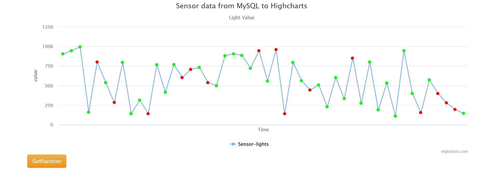
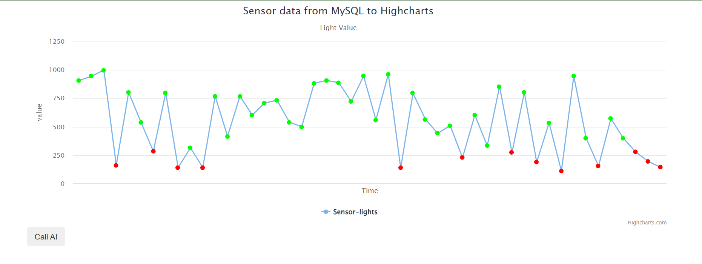

# Norah Lin's New Homework #5 (in 4107029007/aiot_hw5)(app.py setting)
from local generate a new repository on github my test
## Lecture 14: IoT Flask Web (github, vs code)

### Step 1 : Development Environment Setup in aiot_hw5
1. Please install vs code, register github, install git for windows
2. (check-point 1) github create a new repository (aiot0524)
3. go to vs code clone this repository (choose new branch) 
4. vs code 安裝 python extension 
5. pip install flask, pandas, sklearn 
  * 快捷鍵 ctrl+shift+p ===> package manager 叫出 (git clone....)
  * 快捷鍵 ctrl+' ==> 叫出終端機 
6. (check-point 2) 為了要upload local file to github from local要終端機 C:> 設定下面 (不設定 branch default ='main')
   * C:> git config --global user.name "4107029007"
   * C:> git config --global user.email syringanorah@gmail.com
   
7. C:> git remote add origin https://github.com/huanchen1107/aiot_0524.git 

if you want to change

git remote add origin https://github.com/4107029007/aiot_hw5.git
git branch -M main
git push -u origin main
(如果出現 fatal: remote origin already exists，先執行git remote rm origin再繼續執行)

8. 需要打開apach和mysql

### Step 2 : Create a initial html page
1. 用index.html 和 app.py建立簡易初始畫面
2. 在頁面上列印出hello world和this is our hw5的文字

### Step 3 : 用app.py和indexNoAI.html製作出有highchart的頁面
1. 用indexnoAI.html和app.py將db中的資料輸出並畫成highchart

### Step 4: 用app.py和indexAI.html結合logist regression
1. 用indexAI.html和app.py將db中的資料用LR做predict
2. 將predict出來的結果用highchart呈現（在頁面中點擊callAI)

### step 5: 讓highchart可以自由在random或LR間自由切換
1. 保留上一步的callAI按鈕，並加入setRandom按鈕
2. 資料可以點擊setRandom將重新打亂呈現，也可以按callAI將其整理

### 執行步驟:
1. 開啟 xampp
2. DBMS --> add user/pwd = test123/test123
3. pip install flask pandas pymysql sklearn
4. 下載完後執行python app.py

